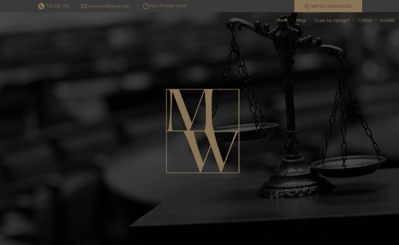

# ⚖️ Website of Law Office of M. Winiarska

## Table of Contents
- [Overview](#overview)
- [Key Features](#key-features)
- [Project Highlights](#project-highlights)
- [Built with](#built-with)
- [License](#license)

## Overview
The Law Office of M. Winiarska landing page is a modern and professional online website designed to showcase legal services effectively. It combines clean design, intuitive navigation, and interactive elements to create a seamless user experience that reflects the professionalism of the firm.

## Key Features
- **Responsive Design:** Fully optimized for desktops, tablets, and mobile devices.
- **Dark and Light Mode:** Switch between themes to suit individual preferences.
- **Interactive Animations:** Subtle animations enhance the user experience without compromising performance.
- **Clear Service Presentation:** Information is organized to highlight key legal services.

## Project Highlights
- **Dynamic Theme Switching:** Users can toggle between light and dark mode for a personalized browsing experience.
- **Elegant Animations:** Engaging transitions and interactive elements add a polished touch to the website.
- **Focused Content Layout:** Minimalist design ensures that the content is front and center, keeping distractions to a minimum.
- **Customizable Design:** The layout and styling can easily be tailored to meet specific branding needs.

## Built with:
- **React.js** - A JavaScript library for building user interfaces.
- **JavaScript (ES6+)** - For functionality and interactivity.
- **HTML5** - Structuring the content of the website.
- **CSS3** - Styling and layout, including animations.
- **Framer Motion** - For smooth and modern animations.
- **Responsive Design Techniques** - Ensures compatibility across all devices.

## License
This project is licensed under the MIT License.
